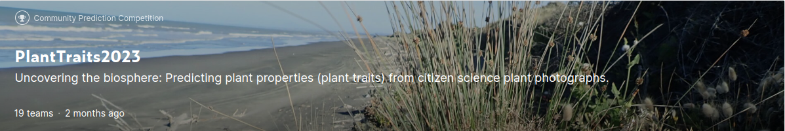
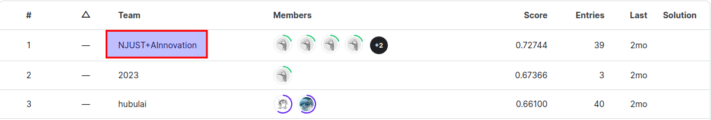

**[PlantTraits2023](https://www.kaggle.com/competitions/planttraits2023/data)**  
**[Ainnovation](https://www.ainnovation.com/)**

**1st place solution**   
Thanks to the organizers for the interesting competition. We were able to get higher correlation results in plant traits. But unfortunately, our scheme could not directly solve this task, and could not effectively get the value of plant traits directly through the picture. By comparing with the image, we found that the traits of plants are also closely related to the growth period of plants, and it is difficult to obtain accurate values only by using the mean and variance of plant traits. There may be different scales or data units in the given data, and we are eager to further solve this problem. We hope this competition can be run all the time.   

**Summary**   
Below I will give a brief explanation of our program.   
1. We utilized OpenCV to read the problematic images and subsequently re-write them to the file system, thereby rectified the corruption issue.    
2. We use the backbone network convnextv2_large[1] models inside the timm model library to train for the classification task and obtain a robust baseline.  
3. The mean values of traits of different plant categories were obtained through data_train_mean.csv file and saved in label2num.json.   
4. Use cutmix[2] for data enhancement.      
5. Concatenate image features with meta data. The final result is obtained through MLP using these features.   
6. Using different probabilities for data addition and model parameter dropout to obtain multiple models, and ensemble to obtain the final classification results of these models.   
7. Finally, we used label2num.json to query the traits of the plants in this category to get the final result.   

**Failed attempt**   
We tried to conduct further regression of plant traits after classification, but due to the small sample size of a single category, the final result was poor.   

**Conclusion**   
Fine-grained visual analysis holds immense practical significance. At present, our results largely depend on the accuracy of classification, and we will further analyze how to obtain better information about plant traits through pictures in the future. Thanks again for hosting this competition, which enriched our intellectual perspective.    

**Reference**   
[1] Woo S, Debnath S, Hu R, et al. ConvNeXt V2: Co-designing and Scaling ConvNets with Masked Autoencoders[J]. arXiv preprint arXiv:2301.00808, 2023.   
[2] S. Yun, D. Han, S. Chun, S. J. Oh, Y. Yoo and J. Choe, "CutMix: Regularization Strategy to Train Strong Classifiers With Localizable Features," 2019 IEEE/CVF International Conference on Computer Vision (ICCV), Seoul, Korea (South), 2019, pp. 6022-6031, doi: 10.1109/ICCV.2019.00612.
